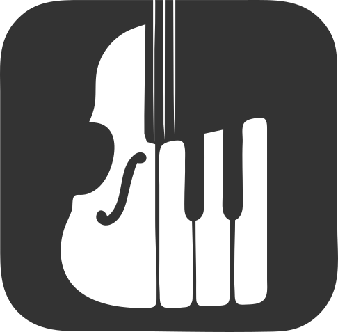
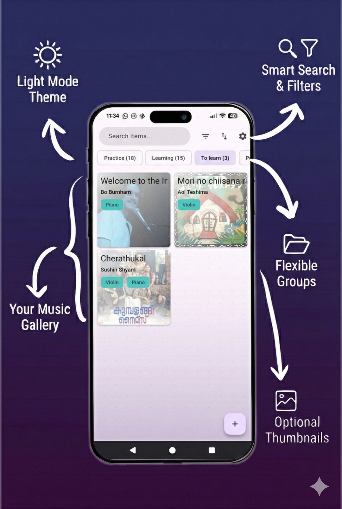
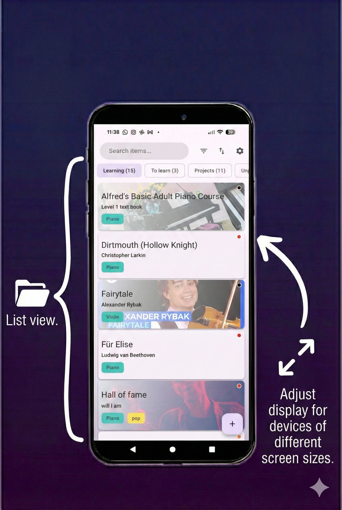
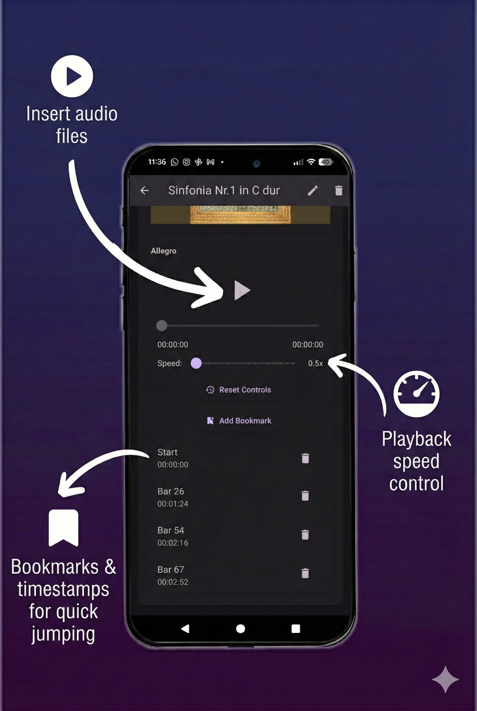
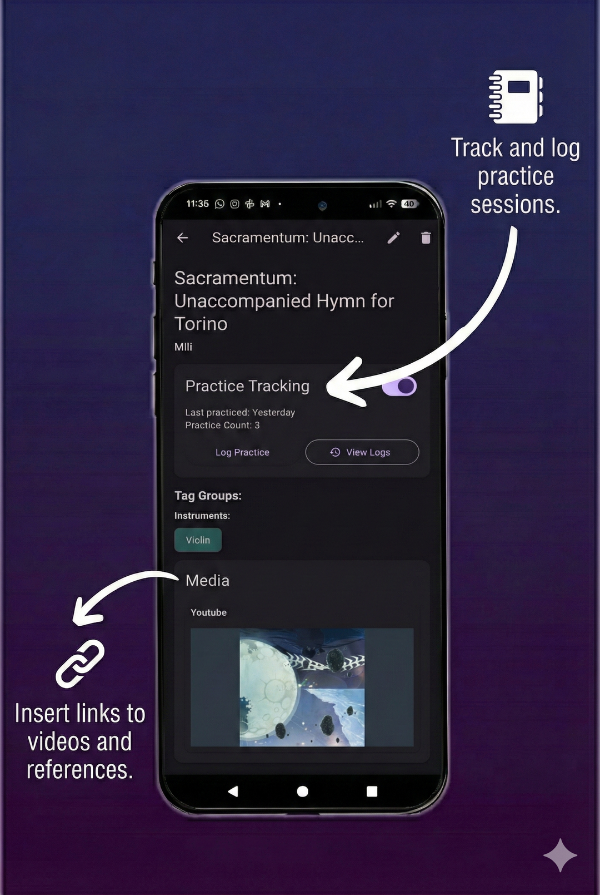
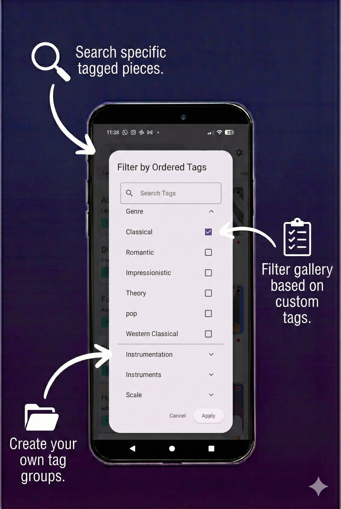
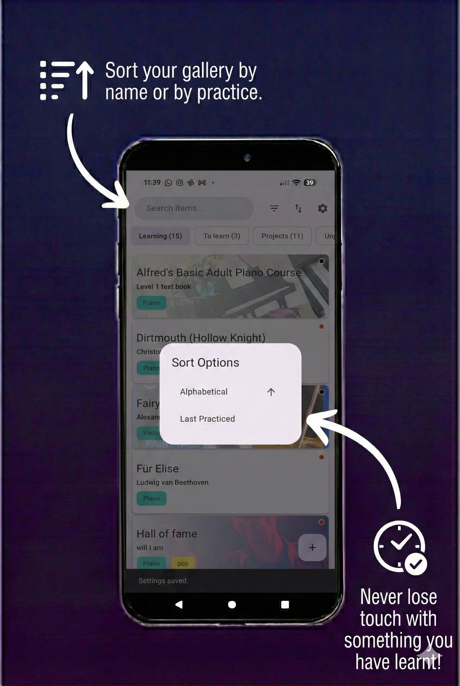
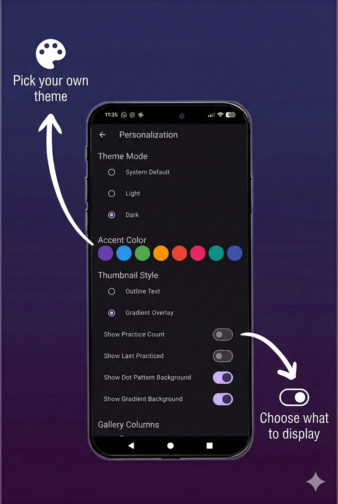
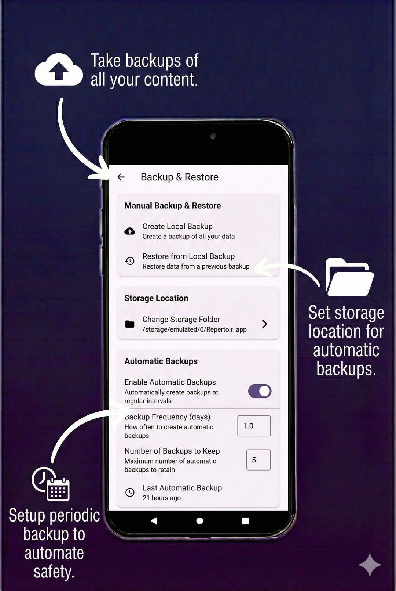

<blockquote>
  🚀 <strong>We're launching on the Google Play Store!</strong> <a href="https://adithyajayan.in/MyRepertoirApp/alpha.html">Join our Alpha Testing Group here</a>.
</blockquote>
 

<!--  -->

# Repertoire: Music Practice & Sheet Music Organizer

**[Download Latest Release](https://github.com/Adithya-Jayan/MyRepertoirApp/releases/latest)** | **[Download Nightly Build](https://github.com/Adithya-Jayan/MyRepertoirApp/releases/tag/nightly)** | **[Download from F-Droid](https://f-droid.org/en/packages/io.github.adithya_jayan.myrepertoirapp.fdroid/)** 

**[View the Webpage](https://adithyajayan.in/MyRepertoirApp/)**

Repertoire is an app designed for musicians, dancers, magicians, or performers to help manage their repertoire, track practice sessions, and organize all related media in one place.

Keep your sheet music, notes, audio recordings, videos, links, and practice logs neatly organized for every piece in your collection.

## Getting Started

### Installation

* **Android**: Follow our **[Step-by-Step Installation Guide](docs/INSTALL.md)** or get it from F-Droid.
* **Windows & Linux**: Download the pre-compiled `.zip` from the releases section, extract, and run.
* **Web**: Access the live web version or download the web build from releases.

### Quick Overview

Once installed, you can:
1. Add your music pieces, dance routines, or other performance pieces
2. Attach sheet music (PDFs), notes, audio files, videos, and images
3. Track your practice sessions
4. Search and filter your collection by tags, genre, or practice history
5. Backup your entire library

## Key Features

**Repertoire Library**
- View your collection in list or grid format
- Each piece shows title, artist/composer, and custom tags

**Media Attachments**
- PDFs for sheet music (viewable in-app)
- Markdown notes for annotations and lyrics
- Images for reference photos
- Audio files with speed control and pitch shifting
- Video links to YouTube or other resources

**Practice Tracking**
- Log practice sessions for each piece
- See when you last practiced
- Track total practice sessions
- Filter pieces by practice history

**Organization**
- Search through titles, composers, and tags
- Filter by genre, difficulty, and custom tags
- Sort by name or longest since practice
- Group and categorize your pieces

**Backup & Restore**
- Manual backup to a single file
- Automatic periodic backups
- Choose your backup location
- Restore from previous backups

## Screenshots

### Gallery View
Create a gallery of all your pieces

  
  

### Media & Practice
Attach all relevant media and track practice sessions

  
  

### Organization & Sorting
Group your pieces and tag them as you wish

  
  

### Customization & Backup
Personalize your experience and keep your data safe

  
  

## Frequently Asked Questions

**Where is my data stored?**
- All your data is stored locally on your device in a private app directory. You can export backups at any time.

**How do I backup or restore my data?**
- Go to Settings > Backup & Restore. You can create manual backups or restore from a previous backup file. Automatic periodic backups are also supported.

**What platforms does the app support?**
- Officially supports Android, Windows, Linux, and Web. macOS support is planned.

## Contributing

We welcome contributions from everyone! Whether you're fixing bugs, adding features, or improving documentation, your help is appreciated.

<!-- 
### Hacktoberfest 2025

We are participating in Hacktoberfest! Look for the `hacktoberfest` and `good first issue` labels in our [issues tab](https://github.com/Adithya-Jayan/MyRepertoirApp/issues).
-->

### How to Contribute

Please read our [Contributing Guidelines](docs/CONTRIBUTING.md) before getting started. It contains instructions on our dual-flavor setup, project structure, and up-to-date tech stack.

## Credits

Thank you to all the people who have contributed! (Please contribute to help improve the app 🥺)

Made with [contrib.rocks](https://contrib.rocks).

## Support & License

For help, bug reports, or feature requests, open an [issue](https://github.com/Adithya-Jayan/MyRepertoirApp/issues).

Distributed under the Apache 2.0 licence. See [NOTICE](NOTICE) and [LICENSE](LICENSE) for more information.
